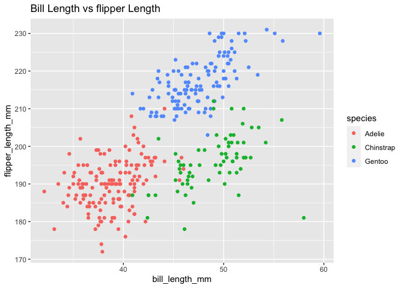

p8105\_hw1\_jf3355
================
Jiahao Fan
9/26/2021

\#Problem 1

This problem is intended to emphasize variable types and introduce
coercion; some awareness of how R treats numeric, character, and factor
variables is necessary for working with these data types in practice.

Create a data frame comprised of:

a random sample of size 10 from a standard Normal distribution a logical
vector indicating whether elements of the sample are greater than 0 a
character vector of length 10 a factor vector of length 10, with 3
different factor “levels”

``` r
set.seed(1)
data_frame = tibble(
  sample = rnorm(10),
  vec_logical = sample > 0,
  vec_char = c("a", "b", "c", "d", "e", "f", "g", "h", "i", "j"),
  vec_factor = factor(c("Large", "Large", "Large", "Medium", "Medium", "Medium", "Small", "Small", "Small", "Small"))
)

#check the data frame
data_frame
```

    ## # A tibble: 10 × 4
    ##    sample vec_logical vec_char vec_factor
    ##     <dbl> <lgl>       <chr>    <fct>     
    ##  1 -0.626 FALSE       a        Large     
    ##  2  0.184 TRUE        b        Large     
    ##  3 -0.836 FALSE       c        Large     
    ##  4  1.60  TRUE        d        Medium    
    ##  5  0.330 TRUE        e        Medium    
    ##  6 -0.820 FALSE       f        Medium    
    ##  7  0.487 TRUE        g        Small     
    ##  8  0.738 TRUE        h        Small     
    ##  9  0.576 TRUE        i        Small     
    ## 10 -0.305 FALSE       j        Small

``` r
#Try to take the mean of each variable in your dataframe. What works and what doesn’t?

mean(pull(data_frame, sample))
```

    ## [1] 0.1322028

``` r
#it works
mean(pull(data_frame, vec_logical))
```

    ## [1] 0.6

``` r
#it works
mean(pull(data_frame, vec_char))
```

    ## Warning in mean.default(pull(data_frame, vec_char)): argument is not numeric or
    ## logical: returning NA

    ## [1] NA

``` r
#it doesn't work
mean(pull(data_frame, vec_factor))
```

    ## Warning in mean.default(pull(data_frame, vec_factor)): argument is not numeric
    ## or logical: returning NA

    ## [1] NA

``` r
#it doesn't work
#this is because `mean()` function doesn't support these two types of variable.
```

\#In some cases, you can explicitly convert variables from one type to
another. Write a code chunk that applies the as.numeric function to the
logical, character, and factor variables (please show this chunk but not
the output). What happens, and why? Does this help explain what happens
when you try to take the mean?

``` r
as.numeric(pull(data_frame, vec_logical))
as.numeric(pull(data_frame, vec_char))
as.numeric(pull(data_frame, vec_factor))

#The logical vector and the factor vector was converted successful. In the logical vector, TURE values are converted to 1,the FALSE values are converted to 0. In the factor vector, the levels were converted to numeric value 1，2，3. The character vector wasn't converted to numbers. The mean of the the logical vector tells us that how likely the sample is true; the character values do not have intrinsic numeric value and does not have a mean;the factor vector does not have a mean even though the levels can be converted numeric because levels are similar to ranks,so the mean has no numerical meaning.
```

\#Problem2

``` r
data("penguins", package = "palmerpenguins")
```

\#Write a short description of the penguins dataset (not the
penguins\_raw dataset) using inline R code, including:

\#the data in this dataset, including names / values of important
variables

``` r
str(penguins)
```

    ## tibble [344 × 8] (S3: tbl_df/tbl/data.frame)
    ##  $ species          : Factor w/ 3 levels "Adelie","Chinstrap",..: 1 1 1 1 1 1 1 1 1 1 ...
    ##  $ island           : Factor w/ 3 levels "Biscoe","Dream",..: 3 3 3 3 3 3 3 3 3 3 ...
    ##  $ bill_length_mm   : num [1:344] 39.1 39.5 40.3 NA 36.7 39.3 38.9 39.2 34.1 42 ...
    ##  $ bill_depth_mm    : num [1:344] 18.7 17.4 18 NA 19.3 20.6 17.8 19.6 18.1 20.2 ...
    ##  $ flipper_length_mm: int [1:344] 181 186 195 NA 193 190 181 195 193 190 ...
    ##  $ body_mass_g      : int [1:344] 3750 3800 3250 NA 3450 3650 3625 4675 3475 4250 ...
    ##  $ sex              : Factor w/ 2 levels "female","male": 2 1 1 NA 1 2 1 2 NA NA ...
    ##  $ year             : int [1:344] 2007 2007 2007 2007 2007 2007 2007 2007 2007 2007 ...

\#The penguins dataset is a compilation of observations of penguin
species (Adelie, Chinstrap, Gentoo) on the islands of Biscoe, Dream,
Torgersen from 2007 - 2009. Bill length, bill depth, flipper length,
body mass,sex were variables that were captured.

the size of the dataset (using nrow and ncol)

``` r
size = nrow(penguins) * ncol(penguins)
size
```

    ## [1] 2752

\#the mean flipper length

``` r
round(mean(pull(penguins,flipper_length_mm), na.rm = TRUE))
```

    ## [1] 201

\#Make a scatterplot of flipper\_length\_mm (y) vs bill\_length\_mm (x);
color points using the species variable (adding color = … inside of aes
in your ggplot code should help).

\#Export your first scatterplot to your project directory using ggsave.

``` r
ggplot(penguins, aes(x=bill_length_mm, y=flipper_length_mm, color = species)) +
    geom_point() +
    ggtitle("Bill Length vs flipper Length")
```

    ## Warning: Removed 2 rows containing missing values (geom_point).

<!-- -->

``` r
ggsave("scatter_plot.pdf", height=6, width = 4)
```

    ## Warning: Removed 2 rows containing missing values (geom_point).
